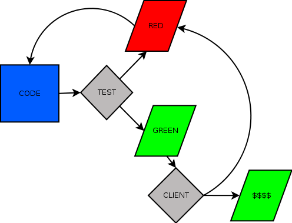

!SLIDE center

# Histoire

!SLIDE

# Comment j'ai commencé BDD

!SLIDE

# Pourquoi je fais du BDD

!SLIDE

# 2005

!SLIDE bullets incremental

# Test After Development

* Un test est mieux que pas de test...
* Tests d'intégration majoritairement

!SLIDE bullets incremental

2006 : Test d'intégration ?
===========================
* Lent : troooop lent
* Mauvais feedback
* Fragilité : Plein de rouge d'un coup
* Obscur : Qu'est-ce qui n'est pas bon ?

!SLIDE

# Ca veut dire quoi, lent ?

!SLIDE center

# On ne s'améliore pas si on ne mesure pas !

### Marie Pia Ignace, Présidente Lean Institute France

!SLIDE

## Lent = 9..18 minutes

!SLIDE center

Mauvais workflow !
==================

!SLIDE

Comment avoir plus de robustesse et de précision ?
==================================================

!SLIDE center smbullets

C'est quoi un test unitaire
===========================

[A Set of Unit Test Rule:](http://www.artima.com/weblogs/viewpost.jsp?thread=126923)
------------------------------------------------------------------------------------

Michael Feathers, @mfeathers

!SLIDE smbullets incremental

Un test n'est pas unitaire si ...
=================================

* il touche la base
* il touche le réseau
* il touche un fichier
* il a des effets de bords sur les autres tests lorsqu'on les lance tous
* on a besoin de modifier une configuration pour le lancer

!SLIDE bullets incremental

2007 : Tests plus rapides
=========================
* Les tests ne partent plus sur le réseau (jmock, easymock, ...)
* Temps de test réduit (2..3 minutes)
* Cool !

!SLIDE bullets incremental

2007 : Et le client, il est content ?
=====================================
* Pas toujours !!

!SLIDE center

Mauvais workflow !
==================

