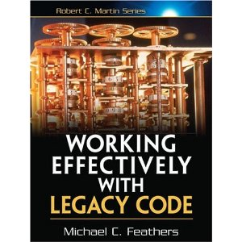

!SLIDE bullets incremental

2007 : Test Driven Development
==============================
* J'ai du rater quelque chose
* Bof ...
* \#fail

!SLIDE bullets incremental
# TDD est dur #

* par QUOI je commence ?
* et par OU ?
* QUAND est-ce que j'arrête ?

!SLIDE

Aide : Livres
=============

!SLIDE center

### Lasse Koskela, @lassekoskela

!SLIDE center

### Michael Feathers, @mfeathers

# 2008 : Test Driven Development #
## (le retour) ##
* Aha
