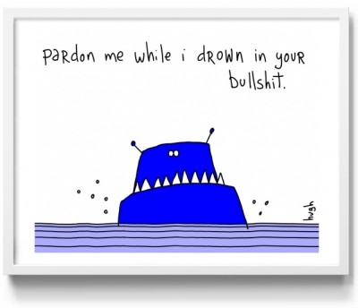
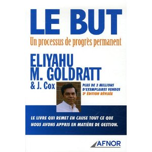

!SLIDE center

Pas trop perdu ?
================

!SLIDE bullets incremental

Jeu
===
* 4 questions
* trouvez avec votre voisin la bonne réponse
* timebox : 1 minute

!SLIDE smbullets

* 1 - Pourquoi fait-on des tests ?
* 2 - Le client a-t-il plus confiance si le test est fait avant ou après ?
* 3 - Quel est le but de TDD ?
* 4 - Quel est le but de BDD ?

!SLIDE center

1 - gagner de l'argent
======================

Eli Goldratt (1947 - 11/06/2011)
[http://www.eligoldratt.com/messages/](http://www.eligoldratt.com/messages/)
[http://kevinrutherford.posterous.com/rip-eli-goldratt](http://kevinrutherford.posterous.com/rip-eli-goldratt)

!SLIDE

2 - Pareil
==========
Ce qui compte est que le produit soit testé
-------------------------------------------
## :)

!SLIDE

3 - le design
=============
Le test est un effet de bord de TDD
-----------------------------------

!SLIDE

4 - On va voir
==============