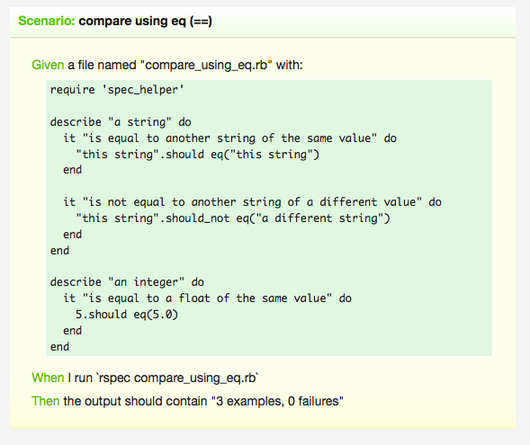

!SLIDE center

Talk is cheap. Show me the code.
================================

Linus Torvalds, torvalds@ppc970.osdl.org

!SLIDE
rails : Triple A
================
pas bdd'ish
-----------

!SLIDE smaller

    @@@ ruby
    # actionmailer/test/asset_host_test.rb
    class AssetHostTest < Test::Unit::TestCase
      def setup
        set_delivery_method :test
        ActionMailer::Base.perform_deliveries = true
        ActionMailer::Base.deliveries.clear
        AssetHostMailer.configure do |c|
          c.asset_host = "http://www.example.com"
          c.assets_dir = ''
        end
      end

      def teardown
        restore_delivery_method
      end

      def test_asset_host_as_string
        mail = AssetHostMailer.email_with_asset
        assert_equal(
          %Q{},
          mail.body.to_s.strip
        )
      end

!SLIDE smaller

    @@@ ruby
    # actionmailer/test/asset_host_test.rb
    class AssetHostTest < Test::Unit::TestCase
      ### arrange
      ###
      def setup
        set_delivery_method :test
        ActionMailer::Base.perform_deliveries = true
        ActionMailer::Base.deliveries.clear
        AssetHostMailer.configure do |c|
          c.asset_host = "http://www.example.com"
          c.assets_dir = ''
        end
      end

      def teardown
        restore_delivery_method
      end

      def test_asset_host_as_string
        mail = AssetHostMailer.email_with_asset
        assert_equal(
          %Q{},
          mail.body.to_s.strip
        )
      end

!SLIDE smaller

    @@@ ruby
    # actionmailer/test/asset_host_test.rb
    class AssetHostTest < Test::Unit::TestCase
      def setup
        set_delivery_method :test
        ActionMailer::Base.perform_deliveries = true
        ActionMailer::Base.deliveries.clear
        AssetHostMailer.configure do |c|
          c.asset_host = "http://www.example.com"
          c.assets_dir = ''
        end
      end

      def teardown
        restore_delivery_method
      end

      def test_asset_host_as_string
        ### ACT
        ###
        mail = AssetHostMailer.email_with_asset
        assert_equal(
          %Q{},
          mail.body.to_s.strip
        )
      end

!SLIDE smaller

    @@@ ruby
    # actionmailer/test/asset_host_test.rb
    class AssetHostTest < Test::Unit::TestCase
      def setup
        set_delivery_method :test
        ActionMailer::Base.perform_deliveries = true
        ActionMailer::Base.deliveries.clear
        AssetHostMailer.configure do |c|
          c.asset_host = "http://www.example.com"
          c.assets_dir = ''
        end
      end

      def teardown
        restore_delivery_method
      end

      def test_asset_host_as_string
        mail = AssetHostMailer.email_with_asset
        ## ASSERT
        ##
        assert_equal(
          %Q{},
          mail.body.to_s.strip
        )
      end

!SLIDE

rspec'ish
=========
https://github.com/mongoid/mongoid
----------------------------------
spec/unit/mongoid/criterion/optional_spec.rb
--------------------------------------------

!SLIDE smaller

    @@@ ruby

    describe Mongoid::Criterion::Optional do

      let(:base) do
        Mongoid::Criteria.new(Person)
      end

      describe "#ascending" do

        context "when providing a field" do

          let(:criteria) do
            base.ascending(:title)
          end

          it "adds the ascending sort criteria" do
            criteria.options[:sort].should == [[ :title, :asc ]]
          end
        end

!SLIDE smaller

    @@@ ruby

    describe Mongoid::Criterion::Optional do
      ## GIVEN
      ##
      let(:base) do
        Mongoid::Criteria.new(Person)
      end

      describe "#ascending" do

        context "when providing a field" do

          let(:criteria) do
            base.ascending(:title)
          end

          it "adds the ascending sort criteria" do
            criteria.options[:sort].should == [[ :title, :asc ]]
          end
        end

!SLIDE smaller

    @@@ ruby

    describe Mongoid::Criterion::Optional do

      let(:base) do
        Mongoid::Criteria.new(Person)
      end

      describe "#ascending" do

        context "when providing a field" do
          ## WHEN
          ##
          let(:criteria) do
            base.ascending(:title)
          end

          it "adds the ascending sort criteria" do
            criteria.options[:sort].should == [[ :title, :asc ]]
          end
        end

!SLIDE smaller

    @@@ ruby

    describe Mongoid::Criterion::Optional do

      let(:base) do
        Mongoid::Criteria.new(Person)
      end

      describe "#ascending" do

        context "when providing a field" do

          let(:criteria) do
            base.ascending(:title)
          end

          ## THEN
          ##
          it "adds the ascending sort criteria" do
            criteria.options[:sort].should == [[ :title, :asc ]]
          end
        end

!SLIDE

cucumber
========

!SLIDE smaller

    @@@ cucumber
    Scenario: compare using eq (==)
      Given a file named "compare_using_eq.rb" with:
        """
        require 'spec_helper'

        describe "a string" do
          it "is equal to another string of the same value" do
            "this string".should eq("this string")
          end

          it "is not equal to another string of a different value" do
            "this string".should_not eq("a different string")
          end
        end

        describe "an integer" do
          it "is equal to a float of the same value" do
            5.should eq(5.0)
          end
        end
        """
      When I run "rspec compare_using_eq.rb"
      Then the output should contain "3 examples, 0 failures"

!SLIDE center

## And it can produce [readable documentation](http://relishapp.com/rspec/rspec-expectations/v/2-6/dir/built-in-matchers/equality-matchers)...

