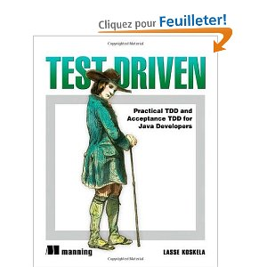

!SLIDE

Aide : Livres
=============

!SLIDE center

### Lasse Koskela, @lassekoskela

!SLIDE center

### Michael Feathers, @mfeathers

!SLIDE center

Introducing BDD
===============

### I decided it must be possible to present TDD in a way that gets straight to the good stuff and avoids all the pitfalls ###
[Introducing BDD, 2006](http://dannorth.net/introducing-bdd/)

### Dan North, @tastapod ###
